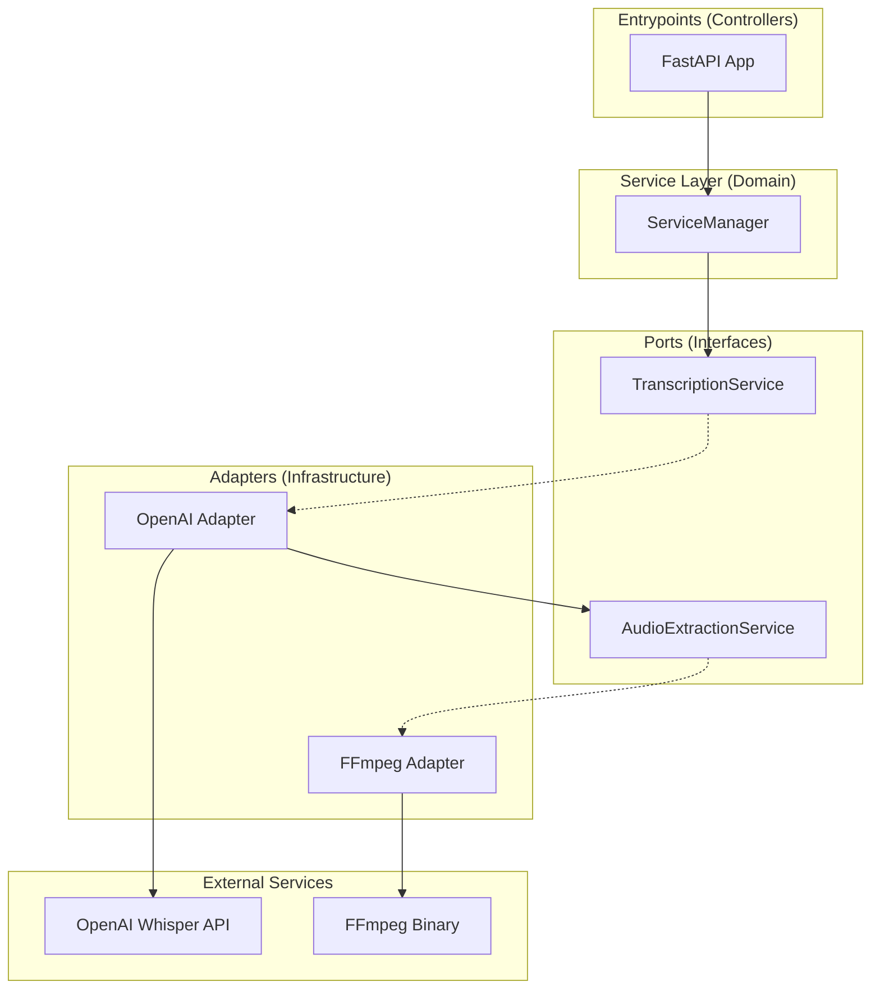

# Video Transcriber API 🎥➡️📝

Una API robusta para transcribir archivos de audio y video a texto utilizando OpenAI Whisper, implementada con **Arquitectura Hexagonal** y principios de **Clean Code**.

## 🏗️ Arquitectura

Este proyecto implementa **Arquitectura Hexagonal** (Ports & Adapters) para garantizar:

- **Separación de responsabilidades**
- **Testabilidad**
- **Flexibilidad para cambiar implementaciones**
- **Independencia de frameworks externos**

### Estructura del Proyecto

```
app/
├── adapters/                    # Adaptadores (Infraestructura)
│   ├── ffmpeg_audio_extraction_adapter.py
│   └── openai_transcription_adapter.py
├── config/                      # Configuración
│   └── logging.py
├── entrypoints/                 # Puntos de entrada (Controllers)
│   ├── dtos.py
│   └── fastapi_app.py
├── service/                     # Lógica de negocio (Dominio)
│   └── manager.py
├── ports.py                     # Puertos (Interfaces)
├── bootstrap.py                 # Inyección de dependencias
└── config.py                    # Configuración general
```

### Diagrama de Arquitectura



## 🔌 Puertos (Interfaces)

### TranscriptionService
Puerto principal para servicios de transcripción:

```python
class TranscriptionService(ABC):
    @abstractmethod
    async def transcribe_from_upload(self, uploaded_file: UploadFile, model: str = "whisper-1") -> str:
        """Transcribe un archivo subido (audio o video) a texto."""
        pass
```

### AudioExtractionService
Puerto para servicios de extracción de audio:

```python
class AudioExtractionService(ABC):
    @abstractmethod
    async def extract_audio_stream(self, uploaded_file: UploadFile) -> tuple[BinaryIO, str]:
        """Extrae audio de un archivo de video/audio y retorna un stream."""
        pass
```

## 🔧 Adaptadores Disponibles

### 1. OpenAI Transcription Adapter
**Ubicación**: `app/adapters/openai_transcription_adapter.py`

**Responsabilidades**:
- Integración con la API de OpenAI Whisper
- Manejo de diferentes formatos de archivo
- Procesamiento de archivos de video (extrae audio automáticamente)
- Gestión de errores de la API externa

**Características**:
- ✅ Soporte para archivos de audio directos
- ✅ Extracción automática de audio desde video
- ✅ Múltiples modelos de Whisper
- ✅ Manejo robusto de errores
- ✅ Logging estructurado

### 2. FFmpeg Audio Extraction Adapter
**Ubicación**: `app/adapters/ffmpeg_audio_extraction_adapter.py`

**Responsabilidades**:
- Extracción de audio desde archivos de video
- Conversión a formatos compatibles con OpenAI
- Optimización de calidad y tamaño

**Características**:
- ✅ Extracción de audio en formato WAV
- ✅ Configuración optimizada para transcripción
- ✅ Manejo de múltiples formatos de video
- ✅ Procesamiento en memoria (sin archivos temporales)
- ✅ Validación de archivos de entrada

## 🌐 API Endpoints

### POST `/transcribe`
Transcribe archivos de audio o video a texto.

**Parámetros**:
- `file` (form-data): Archivo de audio/video a transcribir
- `model` (form-data, opcional): Modelo de OpenAI a utilizar (default: "whisper-1")

**Formatos soportados**:
- **Audio**: MP3, WAV, M4A, FLAC, OGG
- **Video**: MP4, AVI, MOV, MKV, WEBM

**Respuesta exitosa** (200):
```json
{
  "transcription": "Texto transcrito del archivo...",
  "success": true
}
```

**Respuesta de error** (400/500):
```json
{
  "success": false,
  "error": "Descripción del error"
}
```

**Ejemplo con cURL**:
```bash
curl -X POST "http://localhost:8000/transcribe" \
  -F "file=@mi_video.mp4" \
  -F "model=whisper-1"
```

### GET `/health`
Endpoint de health check para monitoreo.

**Respuesta**:
```json
{
  "status": "healthy"
}
```

## 🚀 Instalación y Uso

### Prerrequisitos
- Python 3.12+
- FFmpeg instalado en el sistema
- Cuenta de OpenAI con API key

### 1. Clonar el repositorio
```bash
git clone https://github.com/jval7/video_transcriber.git
cd video_transcriber
```

### 2. Instalar dependencias
```bash
# Usando uv (recomendado)
uv sync

# O usando pip
pip install -r requirements.txt
```

### 3. Configurar variables de entorno
```bash
# Crear archivo .env
echo "OPENAI_API_KEY=tu_api_key_aqui" > .env
```

### 4. Ejecutar la aplicación
```bash
# Desarrollo
python main.py

# Producción
uvicorn main:app --host 0.0.0.0 --port 8000
```

La API estará disponible en: `http://localhost:8000`

### 5. Documentación interactiva
- **Swagger UI**: `http://localhost:8000/docs`
- **ReDoc**: `http://localhost:8000/redoc`

## 🛠️ Tecnologías Utilizadas

### Core
- **FastAPI**: Framework web moderno y rápido
- **Pydantic**: Validación de datos y serialización
- **OpenAI**: API de transcripción Whisper
- **FFmpeg**: Procesamiento de audio/video

### Desarrollo
- **Structlog**: Logging estructurado
- **UV**: Gestión de dependencias rápida
- **Python-dotenv**: Gestión de variables de entorno

### Calidad de Código
- **Black**: Formateo de código
- **Flake8**: Linting
- **MyPy**: Type checking
- **Pylint**: Análisis estático
- **Bandit**: Análisis de seguridad

## 🏛️ Principios de Diseño

### SOLID Principles
- **S**ingle Responsibility: Cada clase tiene una responsabilidad específica
- **O**pen/Closed: Abierto para extensión, cerrado para modificación
- **L**iskov Substitution: Los adaptadores son intercambiables
- **I**nterface Segregation: Interfaces específicas y cohesivas
- **D**ependency Inversion: Dependencias inyectadas a través de interfaces

### Clean Architecture
- **Independencia de frameworks**: La lógica de negocio no depende de FastAPI
- **Testabilidad**: Fácil testing mediante inyección de dependencias
- **Independencia de UI**: La API puede ser reemplazada fácilmente
- **Independencia de base de datos**: Sin dependencias de almacenamiento específico

## 🧪 Testing

```bash
# Ejecutar tests
pytest

# Con coverage
pytest --cov=app tests/
```

## 📝 Logging

El sistema utiliza **logging estructurado** con los siguientes niveles:
- `INFO`: Operaciones normales
- `WARNING`: Situaciones que requieren atención
- `ERROR`: Errores que no detienen la aplicación
- `DEBUG`: Información detallada para debugging

Ejemplo de log:
```json
{
  "timestamp": "2024-01-15T10:30:00Z",
  "level": "info",
  "message": "Transcripción completada exitosamente",
  "filename": "video.mp4",
  "model": "whisper-1",
  "transcription_length": 1250
}
```

## 🤝 Contribución

1. Fork el proyecto
2. Crea una rama para tu feature (`git checkout -b feature/nueva-funcionalidad`)
3. Commit tus cambios (`git commit -m 'Agrega nueva funcionalidad'`)
4. Push a la rama (`git push origin feature/nueva-funcionalidad`)
5. Abre un Pull Request

## 📄 Licencia

Este proyecto está bajo la Licencia MIT. Ver el archivo `LICENSE` para más detalles.

## 🔮 Roadmap

- [ ] Soporte para más modelos de transcripción
- [ ] Cache de transcripciones
- [ ] Procesamiento en lotes
- [ ] Webhooks para notificaciones
- [ ] Interfaz web para upload de archivos
- [ ] Soporte para subtítulos (SRT, VTT)
- [ ] API de traducción
- [ ] Métricas y monitoreo con Prometheus

---

**Desarrollado con ❤️ usando Arquitectura Hexagonal y Clean Code**